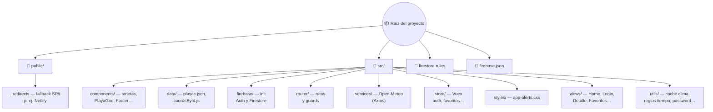

# Portafolio playas (Vue 3 + Firebase)

SPA con playas de América, clima en vivo (**Open-Meteo** + **Axios**), **Firebase Auth** (registro, login, recuperación de contraseña) y favoritos en **Cloud Firestore**.

---

## Tecnologías

| Área | Uso |
|------|-----|
| **Vue 3** | Composition API, `<script setup>` en vistas y componentes principales |
| **Vue Router 4** | History mode; rutas `guestOnly` / `requiresAuth`; `?redirect=` tras login |
| **Vuex 4** | Sesión, escala °C/°F, favoritos |
| **Bootstrap 5** + **Icons** | UI |
| **Firebase** | Auth + Firestore |
| **Open-Meteo** | Pronóstico; caché en `localStorage` (~30 min, `src/utils/forecastCacheConstants.js`) |

Estilos de avisos: `src/styles/app-alerts.css` (`app-banner`, `app-weather-alert`), importado en `main.js`.

---

## Requisitos

- **Node.js** (LTS recomendado) y **npm**
- Proyecto **Firebase** con:
  - **Authentication** → Email/contraseña habilitado
  - **Authentication** → **Settings** → **Authorized domains**: debe incluir el dominio desde el que se sirve la app (`localhost`, `*.netlify.app`, dominio propio, etc.). Necesario para el enlace de **recuperación de contraseña**.
  - **Firestore** activo
  - Reglas: archivo `firestore.rules` en la raíz; publicación con `npm run deploy:firestore-rules` (Firebase CLI enlazado al proyecto)

---

## Instalación y comandos

```bash
npm install
npm run serve                  # desarrollo
npm run build                  # genera /dist
npm run lint
npm run deploy:firestore-rules # solo reglas Firestore
```

Tras cambiar `.env.local`, reinicia `npm run serve`. Tras cambiar variables de producción, vuelve a **`npm run build`** o fuerza un deploy limpio en el hosting.

---

## Variables de entorno

Crear **`.env.local`** en la raíz (está en `.gitignore`) con las claves de la app web en Firebase:

```env
VUE_APP_FIREBASE_API_KEY=
VUE_APP_FIREBASE_AUTH_DOMAIN=
VUE_APP_FIREBASE_PROJECT_ID=
VUE_APP_FIREBASE_STORAGE_BUCKET=
VUE_APP_FIREBASE_MESSAGING_SENDER_ID=
VUE_APP_FIREBASE_APP_ID=
```

**Recuperación de contraseña:** si Firebase devuelve `auth/unauthorized-continue-uri`, define una URL de retorno fija y autorizada:

```env
VUE_APP_PASSWORD_RESET_CONTINUE_URL=https://tu-dominio/login
```

Ejemplo con Netlify: `https://tu-sitio.netlify.app/login` (mismo host que en *Authorized domains*).

- **Desarrollo:** opcional en `.env.local`; en código, `127.0.0.1` se normaliza a `localhost` para la URL por defecto.
- **Producción:** conviene esta variable en **`.env.production`** o **`.env.production.local`** (plantilla: `.env.production.example`) o en el panel del hosting que ejecute el build (p. ej. Netlify).

---

## Despliegue (Netlify u otro hosting estático)

| Configuración | Valor |
|---------------|--------|
| Build command | `npm run build` |
| Publish directory | `dist` |
| Variables | Las mismas `VUE_APP_*` que en local, incluida `VUE_APP_PASSWORD_RESET_CONTINUE_URL` |

En **`public/_redirects`** está `/* /index.html 200` (SPA, rutas profundas); se copia a `dist` al compilar.

El **`firebase.json`** del repo apunta a **reglas de Firestore**; el front puede hospedarse donde elijas.

---

## Rutas

| Ruta | Descripción |
|------|-------------|
| `/` | Home — rejilla de playas y clima |
| `/login` | Login (solo invitados) |
| `/register` | Registro; política en `src/utils/registerPassword.js` (solo invitados) |
| `/forgot-password` | Recuperación por email (solo invitados) |
| `/detalle_playas/:id` | Detalle (**requiere sesión**) |
| `/mis-favoritos` | Favoritos (**requiere sesión**) |

---

## Funcionalidades (resumen)

**Home:** marca en navbar, selector °C/°F, datos Open-Meteo con caché, banners de carga/error, reglas meteorológicas (modal con alerta si aplica). Favoritos en tarjetas solo si hay sesión.

**Detalle:** navbar coherente, carrusel de pronóstico, favorito, alerta inline bajo el carrusel, resumen semanal (`src/utils/weeklyWeatherStats.js`), botón volver arriba con scroll suave (respeta `prefers-reduced-motion`).

**Favoritos:** Firestore `users/{uid}/favorites/{playaId}`; lista vía Vuex; reglas en `firestore.rules`.

**Auth:** banner tras registro según redirección; errores de login/registro se limpian al navegar entre vistas de auth.

### Reglas meteorológicas (`src/utils/weatherAlertRules.js`)

| Alerta | Condición (sobre `pronSem`) |
|--------|-----------------------------|
| Semana lluviosa | ≥ 4 días con estado que incluye *lluvia*, *llovizna* o *chubasco* |
| Ola de calor | ≥ 3 días seguidos con máxima ≥ 30 °C |

Solo se muestra una: si aplican ambas, gana **semana lluviosa**.

---

## Probar caché del clima (manual)

1. **Cargando:** incógnito o borrar en DevTools → *Local Storage* la clave **`forecastById_v1`** y recargar el home.
2. **Error:** sin caché válida, activar *Sin conexión* en la pestaña Red y recargar.

---

## Estructura del repositorio

Visión general: en **GitHub** el diagrama siguiente se muestra al renderizar el README. Si tu editor no lo dibuja, usa el árbol en texto debajo.



**Árbol equivalente (texto plano):**

```text
proyecto/
├── public/
│   └── _redirects          → SPA: /* → /index.html
├── src/
│   ├── components/        → UI reutilizable
│   ├── data/              → playas + coordenadas
│   ├── firebase/          → configuración Firebase
│   ├── router/            → Vue Router
│   ├── services/          → llamadas API (Open-Meteo)
│   ├── store/             → Vuex
│   ├── styles/            → estilos globales de avisos
│   ├── views/             → páginas / rutas
│   └── utils/             → lógica auxiliar
├── firestore.rules
└── firebase.json          → deploy de reglas (CLI)
```

---

## Autor

**Paula Gajardo Schmidlin** — *Estudiante de Front End*  
📧 paulagajardosch@gmail.com  
🐙 [PaulaG73](https://github.com/PaulaG73)

---

*Proyecto académico — 2026*
